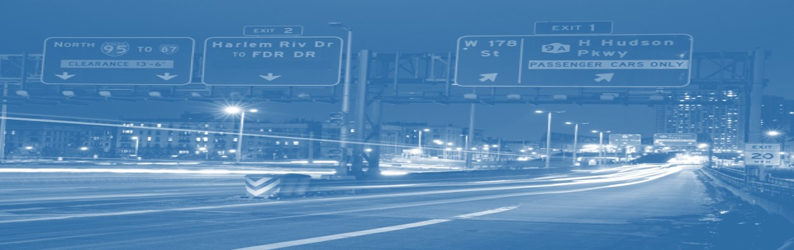
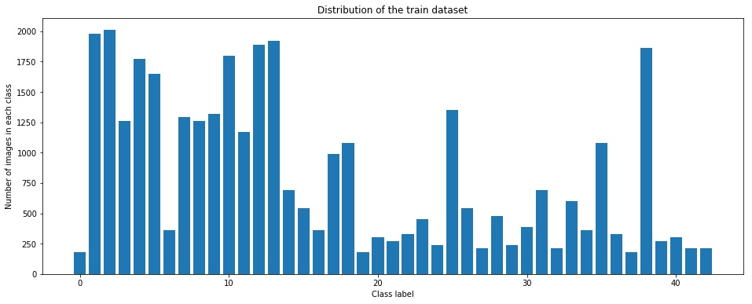
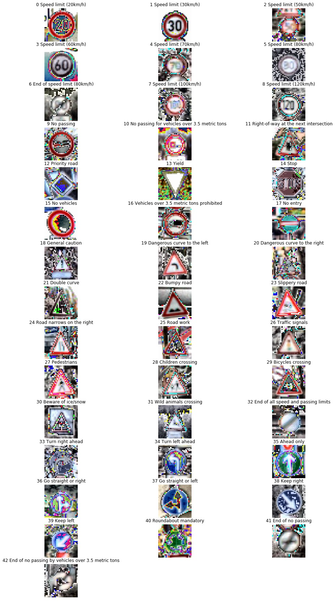
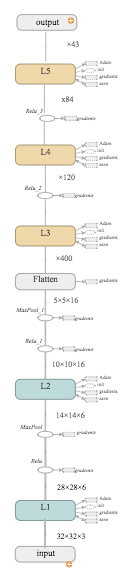
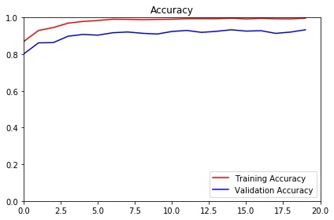
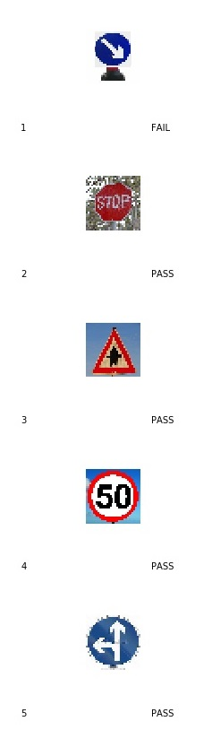
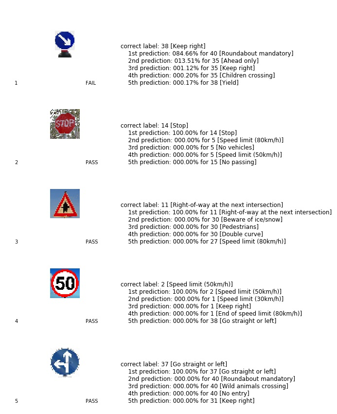

	  
# Self-Driving Car Engineer Nanodegree
	  
## **Traffic Sign Recognition**
	  
**Build a Traffic Sign Recognition Project**	  
	  
The goals / steps of this project are the following:    
  

1. Load the data set (see below for links to the project data set)    
2. Explore, summarize and visualize the data set    
3. Design, train and test a model architecture    
4. Use the model to make predictions on new images    
5. Analyze the softmax probabilities of the new images    
6. Summarize the results with a written report    

  
	  
## Rubric Points
### Here I will consider the [rubric points](#)(#)(https://review.udacity.com/#!/rubrics/481/view) individually and describe how I addressed each point in my implementation.  
	  
---    
### Writeup / README
	  
#### 1. Provide a Writeup / README that includes all the rubric points and how you addressed each one. You can submit your writeup as markdown or pdf. You can use this template as a guide for writing the report. The submission includes the project code.
	  
You're reading it! and here is a link to my [project code](#)(#)(https://github.com/udacity/CarND-Traffic-Sign-Classifier-Project/blob/master/Traffic*Sign*Classifier.ipynb)    
	  
### Data Set Summary & Exploration
	  
#### 1. Provide a basic summary of the data set. In the code, the analysis should be done using python, numpy and/or pandas methods rather than hardcoding results manually.
	  
I used the pandas library to calculate summary statistics of the traffic    
signs data set:    
	  

    # Load pickled data
    import pickle
    
    training*file = './data/train.p'
    validation*file= './data/valid.p'
    testing*file = './data/test.p'
    
    with open(training*file, mode='rb') as f:
        train = pickle.load(f)
    with open(validation*file, mode='rb') as f:
        valid = pickle.load(f)
    with open(testing*file, mode='rb') as f:
        test = pickle.load(f)
        
    X*train, y*train = train, train
    X*valid, y*valid = valid, valid
    X*test, y*test = test, test

  
  
  
	  
#### 2. Include an exploratory visualization of the dataset.
	  
Here is a bar chart showing how the images are distributed.  
  
	  
Min number of images per class = 180  
Max number of images per class = 2010  
I mapped the images with the label and generated an overview.  
	  
### Design and Test a Model Architecture
	  
#### 1. Describe how you preprocessed the image data. What techniques were chosen and why did you choose these techniques? Consider including images showing the output of each preprocessing technique. Pre-processing refers to techniques such as converting to greyscale, normalization, etc. (OPTIONAL: As described in the "Stand Out Suggestions" part of the rubric, if you generated additional data for training, describe why you decided to generate additional data, how you generated the data, and provide example images of the additional data. Then describe the characteristics of the augmented training set like number of images in the set, number of images for each class, etc.)
	  
Initially I worked with a conversion to greyscale. As the result was not satisfactory I experimented with other pre-processing methods and achieved at the end the best results with the equalize-histogram function.   

    import cv2
    def equalize*histogram:
        img*yuv = cv2.cvtColor(img, cv2.COLOR*BGR2YUV)
        # equalize the histogram of the Y channel
        img*yuv[:,:,0](#) = cv2.equalizeHist(img*yuv[:,:,0](#))
        # convert the YUV image back to RGB format
        return cv2.cvtColor(img*yuv, cv2.COLOR*YUV2BGR)
    
    for i in range(n*train):
        X*train[i](#) = equalize*histogram(X*train[i](#))
    
    for i in range(n*validation):
        X*valid[i](#) = equalize*histogram(X*valid[i](#))
    
    for i in range(n*test):
        X*test[i](#) = equalize*histogram(X*test[i](#))

  
  
I was thinking of applying the gray transfer in addition but as the results where already satisfactory I decided to use for simplicity only one function.   
  
As last step I the image data between to improve numeric conditioning.   

    X*train = (X*train-128.0)/128.0
    X*valid = (X*valid-128.0)/128.0
    X*test = (X*test-128.0)/128.0

	  
The resulting images looked like this:  
  
  
  
I did not create additional data as I wanted to see if the model can perform well enough with a minimal data set.   
To create additional images I would have used various distortion techniques of the initial images could have been used and the data set enlarged by that.  
  
	  
  
	  
The difference between the original data set and the augmented data set is the following ...     
	  
	  
#### 2. Describe what your final model architecture looks like including model type, layers, layer sizes, connectivity, etc.) Consider including a diagram and/or table describing the final model.
	  
I used an architecture similar to the LeNet architecture as it showed good results for image classification problems.   
  
The bellow diagram shows the network architecture in detail.  
  
  
	  
  

     # Layer 1: Convolutional. Input = 32x32x3. Output = 28x28x6.
        with tf.name*scope('L1'):
            conv1*w = tf.Variable(tf.truncated*normal(shape=(5,5,3,6), mean=mu, stddev=sigma))
            conv1*b = tf.Variable(tf.zeros(6))
            conv1 = tf.nn.conv2d(x, conv1*w, strides=[1,1,1,1](#), padding='VALID') + conv1*b
        
            # Activation.
            conv1 = tf.nn.relu(conv1)
        
        # Pooling. Input = 28x28x6. Output = 14x14x6.
        conv1 = tf.nn.max*pool(conv1, ksize=[1,2,2,1](#), strides=[1,2,2,1](#), padding='VALID')
        
        # Layer 2: Convolutional. Output = 10x10x16.
        with tf.name*scope('L2'):
            conv2*w = tf.Variable(tf.truncated*normal(shape=(5,5,6,16), mean=mu, stddev=sigma))
            conv2*b = tf.Variable(tf.zeros(16))
            conv2 = tf.nn.conv2d(conv1, conv2*w, strides=[1,1,1,1](#), padding='VALID') + conv2*b
        
            # Activation.
            conv2 = tf.nn.relu(conv2)
        
        # Pooling. Input = 10x10x16. Output = 5x5x16.
        conv2 = tf.nn.max*pool(conv2, ksize=[1,2,2,1](#), strides=[1,2,2,1](#), padding='VALID')
        
        # Flatten. Input = 5x5x16. Output = 400.
        fc0 = tf.contrib.layers.flatten(conv2)
        
        # Layer 3: Fully Connected. Input = 400. Output = 120.
        with tf.name*scope('L3'):
            fc1*W = tf.Variable(tf.truncated*normal(shape=(400,120), mean=mu, stddev=sigma))
            fc1*b = tf.Variable(tf.zeros(120))
            fc1 = tf.matmul(fc0, fc1*W) + fc1*b
        
            # Activation.
            fc1 = tf.nn.relu(fc1)
    
        # Layer 4: Fully Connected. Input = 120. Output = 84.
        with tf.name*scope('L4'):
            fc2*W = tf.Variable(tf.truncated*normal(shape=(120,84), mean=mu, stddev=sigma))
            fc2*b = tf.Variable(tf.zeros(84))
            fc2 = tf.matmul(fc1, fc2*W) + fc2*b
        
            # Activation.
            fc2 = tf.nn.relu(fc2)
        
        # Layer 5: Fully Connected. Input = 84. Output = 43.
        with tf.name*scope('L5'):
            fc3*W = tf.Variable(tf.truncated*normal(shape=(84,43), mean=mu, stddev=sigma))
            fc3*b = tf.Variable(tf.zeros(43))
            logits = tf.matmul(fc2, fc3*W) + fc3*b

	  
	  
#### 3. Describe how you trained your model. The discussion can include the type of optimizer, the batch size, number of epochs and any hyperparameters such as learning rate.
	  
To train the model I used the following parameters:  
  

- EPOCHS = 20  
- BATCH SIZE = 150  
- LEARNING RATE = 0.001  
- OPTIMIZER = Adam   

  
  
  
	  
#### 4. Describe the approach taken for finding a solution and getting the validation set accuracy to be at least 0.93. Include in the discussion the results on the training, validation and test sets and where in the code these were calculated. Your approach may have been an iterative process, in which case, outline the steps you took to get to the final solution and why you chose those steps. Perhaps your solution involved an already well known implementation or architecture. In this case, discuss why you think the architecture is suitable for the current problem.
	  
My final model results were:    
  

- training set accuracy of 0.997   
- validation set accuracy of 0.934    
- test set accuracy of 0.917  

  
  
	  
  
	  
If an iterative approach was chosen:    
  
I used a variation of the LeNet architecture as this seemed to be well fitted for image classification problems.  
  
I experimented first with the various methods for image pre processing to achieve an accuracy of above 90%.   
I optimised then the Dropouts and input features to avoid over and underfitting.   
I experimeneted with an higher number of EPOCHS but this increased processing time with no significant accuracy improvement. Accuracy increase was rather achieved by increasing the BATCHSIZE from 120 to 150   
  
	  
	  
### Test a Model on New Images
	  
#### 1. Choose five German traffic signs found on the web and provide them in the report. For each image, discuss what quality or qualities might be difficult to classify.
	  
Here are five German traffic signs that I found on the web:    
  
	  
  
	  
#### 2. Discuss the model's predictions on these new traffic signs and compare the results to predicting on the test set. At a minimum, discuss what the predictions were, the accuracy on these new predictions, and compare the accuracy to the accuracy on the test set (OPTIONAL: Discuss the results in more detail as described in the "Stand Out Suggestions" part of the rubric).
	  
Here are the results of the prediction:    
	  
  
	  
	  
The model was able to correctly guess 4 of the 5 traffic signs, which gives an accuracy of 80%. Nevertheless this suggest that further variations of the signs should be used for training the model to be prepared for real-life situations.  
	  
#### 3. Describe how certain the model is when predicting on each of the five new images by looking at the softmax probabilities for each prediction. Provide the top 5 softmax probabilities for each image along with the sign type of each probability. (OPTIONAL: as described in the "Stand Out Suggestions" part of the rubric, visualizations can also be provided such as bar charts)
	  
  
For the first image, the model is relatively sure that this is a stop sign (probability of 0.6), and the image does contain a stop sign. The top five soft max probabilities are:    
	  
  
	  
  
	  
	  
